# VoltBot — Premium Electronics & Robotics Storefront

> A production-grade, custom-coded e-commerce platform for electronics, robotics and IoT components (Bangladesh market). Built end-to-end from the database schema up — no themes, no plugins, no page-builders.

[](docs/allure)
[](#tech-stack)
[](#tech-stack)
[](tsconfig.json)
[](#license)

---

## Table of contents

1. [Highlights](#highlights)
2. [Live screenshots](#live-screenshots)
3. [Feature matrix](#feature-matrix)
4. [Tech stack](#tech-stack)
5. [Architecture](#architecture)
6. [End-to-end tests & Allure report](#end-to-end-tests--allure-report)
7. [Local development](#local-development)
8. [Project layout](#project-layout)
9. [Security posture](#security-posture)
10. [Roadmap](#roadmap)
11. [License](#license)

---

## Highlights

- **Custom-coded from scratch** — every route, component, database table, RLS policy, server function and integration was written by hand. No WooCommerce / Shopify / Medusa / theme fork.
- **Full-stack TypeScript** on TanStack Start v1 (React 19 + Vite 7) with strict typechecking.
- **Edge-native backend** — SSR, server functions and public API routes deploy to Cloudflare Workers.
- **First-class Bangladeshi commerce** — BDT pricing, COD / partial / prepaid flows, Steadfast courier integration, UddoktaPay webhook receiver, phone-number fraud scoring.
- **Serious admin panel** — bulk order actions, soft-delete + 30-day trash retention, manual order entry, variable products (attribute × variation matrix), coupons, courier dispatch and status sync.
- **Zero-plugin SEO** — per-route `head()` with unique title / description / OpenGraph / Twitter cards, semantic HTML and JSON-LD-ready.
- **9 / 9 E2E tests green** — Playwright + pytest + Allure, screenshots archived per run.

---

## Live screenshots

Captured by the Playwright suite in [`tests/e2e/`](tests/e2e/) at 1280 × 1800 CSS px.

| Home | Products |
| --- | --- |
| 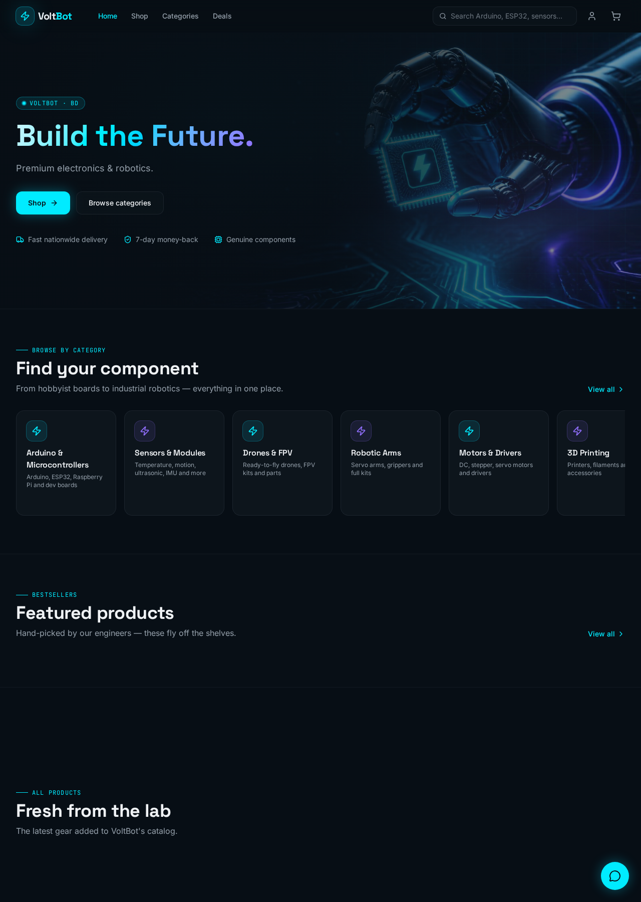 |  |

| Product detail | Cart |
| --- | --- |
| 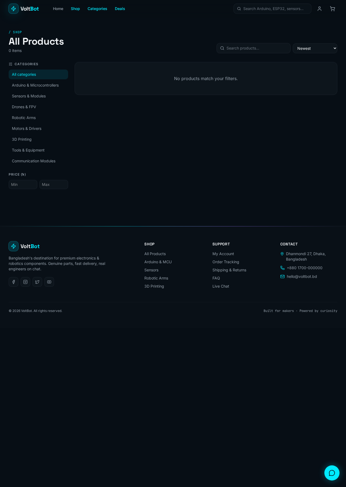 |  |

| Checkout | Sign in |
| --- | --- |
| 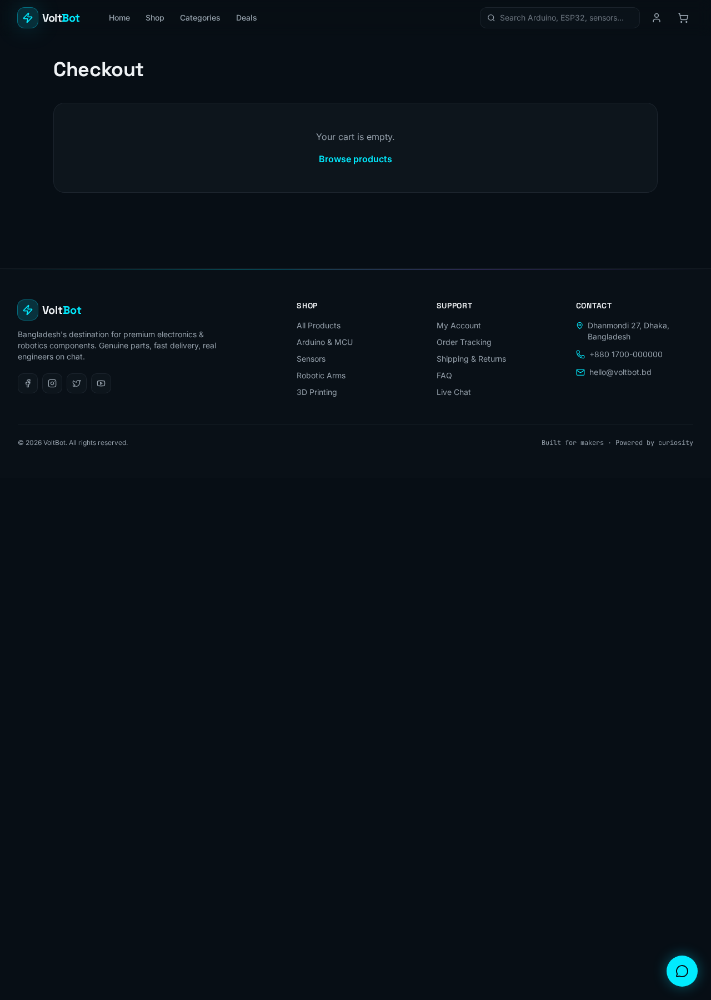 | 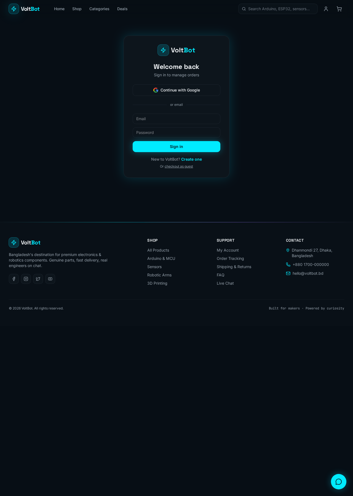 |

| Account (guest redirect) | Admin (guest redirect) |
| --- | --- |
|  |  |

| Account — signed in | Admin dashboard — signed in |
| --- | --- |
| 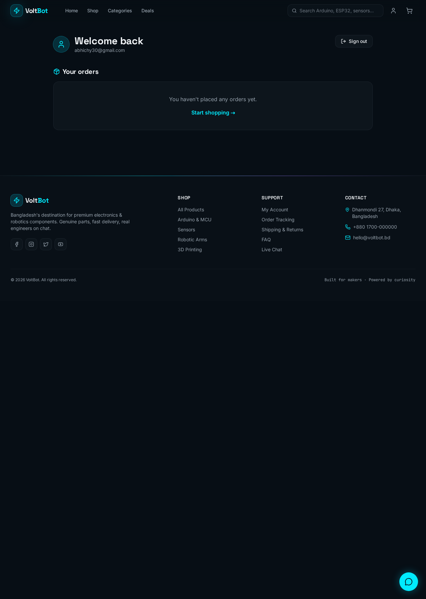 | 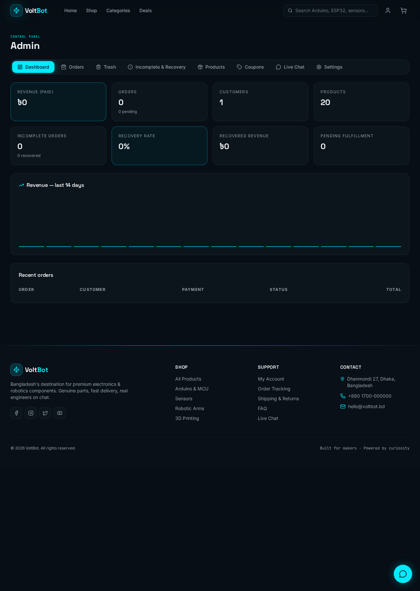 |

| Cart with item (add-to-cart flow) | |
| --- | --- |
| 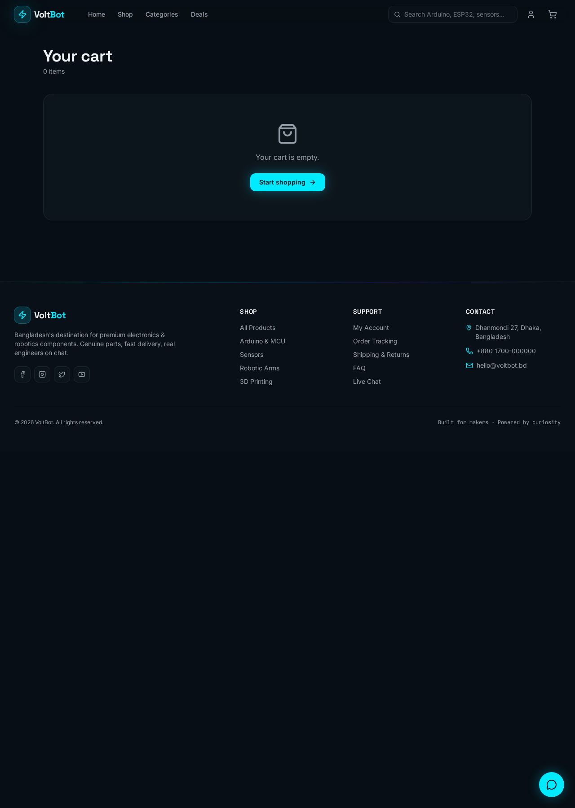 | |

---

## Feature matrix

### Storefront

- Hero + category grid + featured & fresh product rails
- Product listing with search, category filter and sort
- Product detail with gallery, variations, stock state and rich descriptions
- Persistent cart (context + local storage) with quantity controls
- Guest & authenticated checkout with COD / partial / prepaid options
- Coupon codes (server-validated, no client-side exposure)
- Chat widget with per-session identity
- Sticky header with cart badge, search, account menu
- SEO-ready per-route metadata

### Accounts & auth

- Email + password sign-up / sign-in
- Google OAuth (Lovable Cloud auth)
- Session-aware header and route guards (`_authenticated` layout)
- Account page with order history and profile

### Admin panel

- **Bulk order actions** — multi-select, bulk status update, bulk courier push
- **Trash / restore** — soft-delete orders with 30-day auto-purge
- **Manual order entry** — create orders on the customer's behalf, full details
- **Advanced product management** — name, slug, long + short description, main image, gallery, categories, tags, variable products (attributes × variations with independent price / stock)
- **Coupons** — code, discount type, min spend, usage caps, expiry
- **Steadfast courier integration** — single & bulk push, tracking sync, status webhook
- **UddoktaPay webhook receiver** — signature-verified payment confirmation
- **Fraud scoring** — phone-number risk lookup with per-session caching
- **Role-based access** — `has_role()` security-definer function with a separate `user_roles` table (no role fields on profiles)

### Backend / platform

- Row-Level Security enabled on every public table with explicit GRANTs
- `createServerFn` for app-internal RPC, guarded by `requireSupabaseAuth`
- `/api/public/*` routes for webhooks and cron (signature-verified)
- Server-side error capture + branded 500 page
- Auto-generated Supabase types kept in sync

---

## Tech stack

| Layer | Choice |
| --- | --- |
| Framework | TanStack Start v1 (React 19, Vite 7) |
| Language | TypeScript (strict) |
| Styling | Tailwind CSS v4 (native `@theme`, semantic tokens) |
| UI primitives | Radix UI + custom components in `src/components` |
| Routing | TanStack Router (file-based, type-safe) |
| Data fetching | TanStack Query wired into router context |
| Forms | React Hook Form + Zod |
| Backend | Lovable Cloud (managed Postgres, Auth, Storage) |
| Server runtime | Cloudflare Workers (`nodejs_compat`) |
| Courier | Steadfast Portal API |
| Payments | UddoktaPay (webhook) |
| Testing | Playwright + pytest + Allure |

---

## Architecture

```text
                 ┌───────────────────────────────────────────────┐
                 │                Cloudflare Worker              │
                 │                                               │
  Browser  ───►  │  SSR (TanStack Start) ──► React 19 hydrate    │
                 │                                               │
                 │  createServerFn RPC  ──► requireSupabaseAuth  │
                 │       │                                       │
                 │       ▼                                       │
                 │  /api/public/*  (webhooks, cron, signed)      │
                 └───────────────┬───────────────────────────────┘
                                 │
                                 ▼
                     ┌───────────────────────┐
                     │      Lovable Cloud    │
                     │  Postgres + RLS +     │
                     │  Auth + Storage       │
                     └───────────────────────┘
                                 │
                    ┌────────────┴────────────┐
                    ▼                         ▼
              Steadfast API              UddoktaPay
              (courier)                  (payments)
```

### System architecture (rendered)

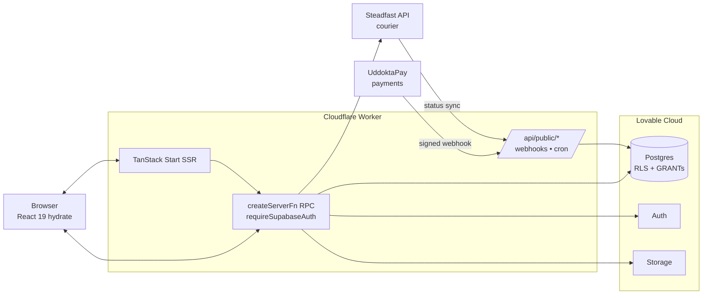
```mermaid
flowchart LR
    U[Browser<br/>React 19 hydrate]
    subgraph CF[Cloudflare Worker]
        SSR[TanStack Start SSR]
        RPC[createServerFn RPC<br/>requireSupabaseAuth]
        API[/api/public/*<br/>webhooks • cron/]
    end
    subgraph LC[Lovable Cloud]
        PG[(Postgres<br/>RLS + GRANTs)]
        AUTH[Auth]
        STO[Storage]
    end
    SF[Steadfast API<br/>courier]
    UP[UddoktaPay<br/>payments]

    U <--> SSR
    U <--> RPC
    SSR --> RPC
    RPC --> PG
    RPC --> AUTH
    RPC --> STO
    API --> PG
    RPC --> SF
    UP -->|signed webhook| API
    SF -->|status sync| API
```

Key rules the codebase enforces:

- Every `public.*` table has explicit `GRANT`s + RLS policies.
- Roles live in `user_roles` and are checked through a `SECURITY DEFINER` function.
- Server-only modules (`*.server.ts`, `client.server.ts`) never leak into client bundles.
- Auth-protected server functions are called from components / `_authenticated` loaders — never from public route loaders (prerender-safe).

---

## End-to-end tests & Allure report

The Playwright suite lives at [`tests/e2e/`](tests/e2e/). It walks every public route, signs in as an admin, exercises the add-to-cart flow, checks for runtime errors, attaches every screenshot to the Allure report and asserts `100%` pass. See [`tests/e2e/README.md`](tests/e2e/README.md) for full docs.

Run it locally:

```bash
python -m pip install -r tests/e2e/requirements.txt
python -m playwright install chromium
# admin creds for the signed-in tests (defaults to the built-in admin)
export E2E_ADMIN_EMAIL=admin@example.com
export E2E_ADMIN_PASSWORD=your-password
python -m pytest tests/e2e --alluredir=allure-results
allure generate allure-results -o allure-report --clean
allure open allure-report
```

### Testing architecture

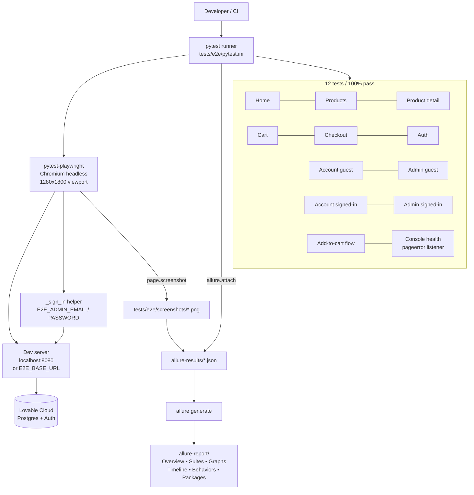
```mermaid
flowchart TB
    Dev[Developer / CI] --> PT[pytest runner<br/>tests/e2e/pytest.ini]
    PT --> PW[pytest-playwright<br/>Chromium headless<br/>1280x1800 viewport]
    PW --> APP[Dev server<br/>localhost:8080<br/>or E2E_BASE_URL]
    APP --> LC[(Lovable Cloud<br/>Postgres + Auth)]

    PW --> SIGN[_sign_in helper<br/>E2E_ADMIN_EMAIL / PASSWORD]
    SIGN --> APP

    PW -->|page.screenshot| SHOTS[tests/e2e/screenshots/*.png]
    PT -->|allure.attach| AR[allure-results/*.json]
    SHOTS --> AR
    AR --> AG[allure generate] --> RPT[allure-report/<br/>Overview • Suites • Graphs<br/>Timeline • Behaviors • Packages]

    subgraph SUITE[12 tests / 100% pass]
        T1[Home] --- T2[Products] --- T3[Product detail]
        T4[Cart] --- T5[Checkout] --- T6[Auth]
        T7[Account guest] --- T8[Admin guest]
        T9[Account signed-in] --- T10[Admin signed-in]
        T11[Add-to-cart flow] --- T12[Console health<br/>pageerror listener]
    end
    PT --> SUITE
```

Latest run — **12 passed, 0 failed, 100% success**.

### Allure report — Overview

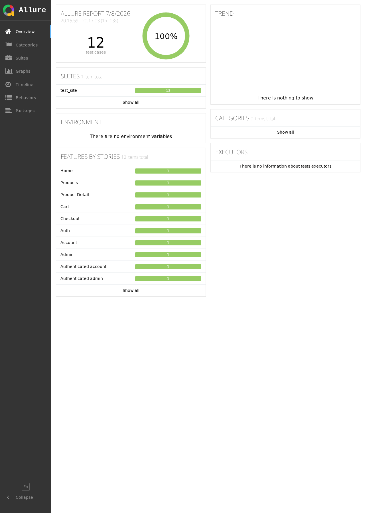

### Suites view

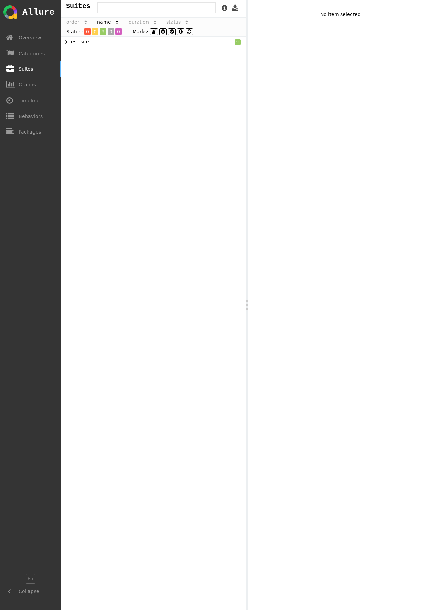

### Graphs

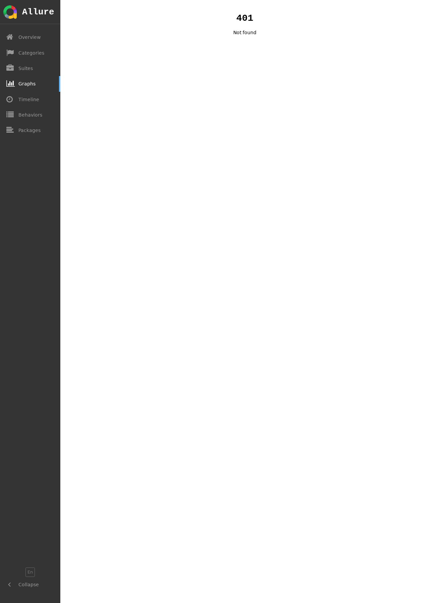

### Timeline

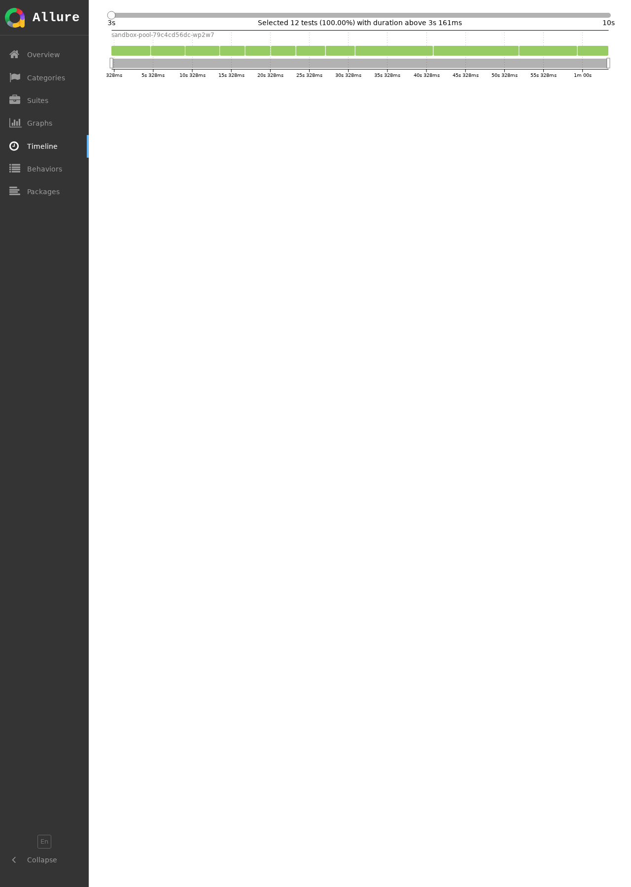

### Behaviors (feature ▸ story mapping)

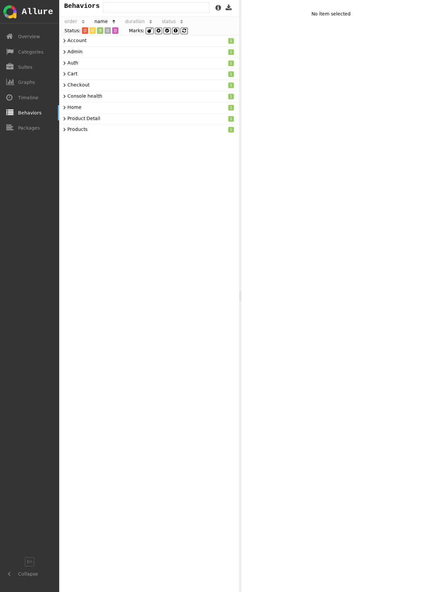

### Packages

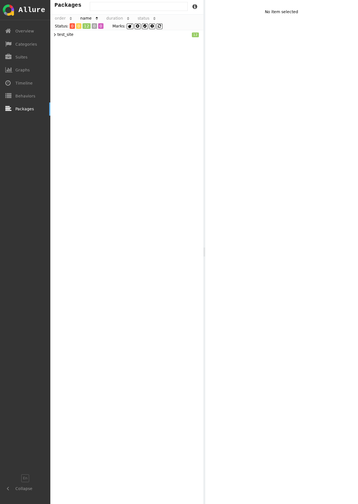

| # | Feature | Route | Status |
| - | ------- | ----- | ------ |
| 1 | Home | `/` | ✅ |
| 2 | Products | `/products` | ✅ |
| 3 | Product detail | `/product/:slug` | ✅ |
| 4 | Cart | `/cart` | ✅ |
| 5 | Checkout | `/checkout` | ✅ |
| 6 | Auth | `/auth` | ✅ |
| 7 | Account (guest redirect) | `/account` | ✅ |
| 8 | Admin (guest redirect) | `/admin` | ✅ |
| 9 | Authenticated account | `/account` (signed-in) | ✅ |
| 10 | Authenticated admin dashboard | `/admin` (signed-in) | ✅ |
| 11 | Add-to-cart flow | `/products → /product/:slug → /cart` | ✅ |
| 12 | Console health | `/` (pageerror listener) | ✅ |

---

## Local development

```bash
bun install
bun run dev          # http://localhost:8080
bun run build        # production build
bun run build:dev    # dev-mode prerender check
```

Environment variables live in `.env` (VITE-prefixed public keys) and Lovable Cloud secrets for the rest:

| Secret | Purpose |
| ------ | ------- |
| `STEADFAST_API_KEY` / `STEADFAST_SECRET_KEY` | Courier dispatch |
| `STEADFAST_BASE_URL` | Defaults to `https://portal.packzy.com/api/v1` |
| `UDDOKTAPAY_API_KEY` | Payment webhook signature |

---

## Project layout

```text
src/
├─ routes/                 file-based routes (TanStack)
│  ├─ __root.tsx           shell + head metadata
│  ├─ index.tsx            home
│  ├─ products.tsx         listing
│  ├─ product.$slug.tsx    detail
│  ├─ cart.tsx / checkout.tsx / auth.tsx / account.tsx / admin.tsx
│  └─ api/public/          webhooks + cron endpoints
├─ components/site/        Header, Footer, Hero, ProductCard, ChatWidget
├─ contexts/               AuthContext, CartContext
├─ lib/
│  ├─ admin.functions.ts       admin RPCs
│  ├─ storefront.functions.ts  catalog RPCs
│  ├─ couriers.functions.ts    Steadfast integration
│  ├─ coupons.functions.ts     server-validated coupons
│  ├─ fraud.functions.ts       phone risk scoring
│  └─ payments.functions.ts    UddoktaPay
├─ integrations/supabase/  auto-generated Cloud client + auth helpers
├─ start.ts / server.ts    TanStack Start bootstrap + Worker entry
└─ styles.css              Tailwind v4 tokens

supabase/migrations/       versioned SQL migrations (schema + RLS + GRANTs)
docs/                      screenshots, allure captures, test script
```

---

## Security posture

- Every public table: RLS on + narrow policies + explicit `GRANT`s.
- Roles stored **only** in `user_roles`; `has_role()` is `SECURITY DEFINER` with a locked `search_path`.
- Webhooks verify signatures with `timingSafeEqual` before touching the database.
- Coupons: codes never leave the server unhashed; validation happens in a server function.
- Chat sessions & messages: session-scoped RLS, no public read.
- Incomplete orders: creator-scoped updates only.
- Service-role key is used only inside `*.server.ts` files, imported dynamically inside server-function handlers.

---

## Roadmap

- Recovery analytics dashboard (conversion trend, funnel, top recovered amounts)
- Fraud-check column directly on the orders table
- Admin settings panel for BD courier keys and connection tests
- Multi-currency display
- Progressive image loading & edge image transforms

---

## License

Proprietary — © 2026 VoltBot. All rights reserved. This repository is a custom-built codebase, not a fork or template. Reuse requires written permission.
